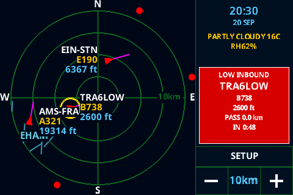
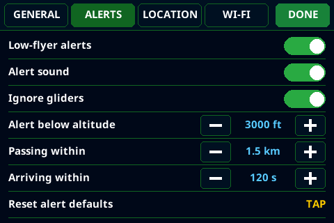
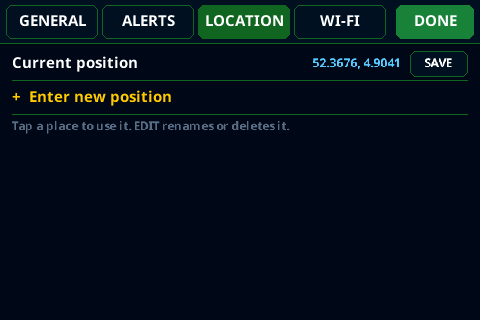
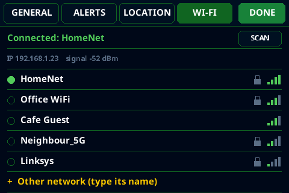
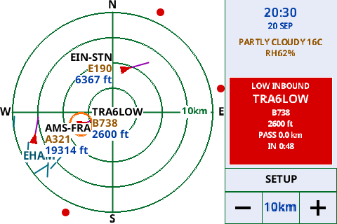

# Plane Radar

> **This is a fork** of [ironicbadger/ESP32-Plane-Radar](https://github.com/ironicbadger/ESP32-Plane-Radar). It adds a second hardware target — an **ESP32-S3 (Wemos S3 Mini) with a 4″ 480×320 touch display** — plus on-device settings, saved places, low-flyer alerts with a buzzer, and a desktop simulator. The original ESP32-C3 + round-display target still builds unchanged. See [This fork](#this-fork-esp32-s3--4-touch-display) below, and the [changelog](CHANGELOG.md) for what changed.


*Original ESP32-C3 round-display build (upstream photo).*

**Upstream 3D printed case (round-display version):** [MakerWorld](https://makerworld.com/en/models/2872376-esp32-plane-radar-live-ads-b-on-a-round-display#profileId-3207083) · **Firmware:** [Releases](../../releases)

Firmware for an **ESP32-C3 Super Mini** and a **1.28″ round GC9A01** display (240×240), or an **ESP32-S3** with a **4″ ST7796S** touch display (480×320). Shows a circular **ADS-B radar** around your configured location, with flight routes, detailed aircraft models, local weather/time, browser settings, and authenticated OTA updates.

## This fork: ESP32-S3 + 4″ touch display

Build with the **`s3mini`** PlatformIO environment (`pio run -e s3mini -t upload`). Everything below applies to that target; the C3 build keeps the original behaviour.

*Screenshots are renders from the desktop simulator (see [`sim/`](sim/README.md)), not photos of the device.*



- **480×320 layout** — a 320 px radar on the left; clock, weather, the alert banner and touch controls in a panel on the right.
- **Day / Night theme** — the default Night theme is light on dark. Switch on **SETUP → General → Day theme (sunlight)** for a white background with black text and darker colours, which stays readable in direct sunlight where a dark screen is washed out by reflections. The choice is saved and also applies to the Wi‑Fi screen at boot.
- **Touch controls** — `[-] [range] [+]` zoom buttons, a **SETUP** button, and tap-to-dismiss on the alert banner. The touch panel is calibrated once on first boot (four crosshairs) and the result is stored in flash; hold the range box for 3 s to recalibrate.
- **On-device settings** (no phone needed): **General** (day theme, runways, clock/weather panel, weather, text size), **Alerts**, **Location** and **Wi‑Fi**. The 24-hour clock, temperature unit and distance unit stay on their defaults (24 h, °C, km) and can only be changed from the web setup page.
- **Saved places** — keep up to six named locations and switch between them with one tap; type new coordinates on an on-screen number pad. Switching clears stale aircraft and refetches traffic and weather for the new position.
- **Wi‑Fi on the screen** — scan, pick a network and type the password on an on-screen keyboard (masked, with SHOW/HIDE and a symbols layer). The same screen appears at boot when there is no working network, with the phone portal as a fallback button.
- **Low-flyer alerts** — an aircraft heading towards your position triggers a yellow ring on the radar and a flashing banner (callsign, type, altitude, pass distance, countdown) when its projected closest approach is within a set distance and time, and below a set altitude (projected with its climb or descent rate). Thresholds, an **Ignore gliders** filter and an **Alert sound** toggle are in the Alerts tab; tapping the banner dismisses that aircraft until it leaves the alert zone.
- **Buzzer** — an optional passive piezo on GPIO 17 beeps while an alert is pending.
- **Latitude-aware distances** — east–west distances are scaled by the cosine of the radar's latitude, so the picture is true to scale wherever you set the position.
- **Desktop simulator** — run the real UI code on a PC with fake aircraft, scripted taps and screenshots, so layout and flows can be tested without the hardware ([`sim/README.md`](sim/README.md)).

<p>
  
  
  
</p>



*The same alert scene in the Day theme.*

**Quick start (S3):**

1. Wire the display, touch and (optionally) the buzzer as in [the wiring table](#wiring-st7796s--xpt2046--wemos-s3-mini), or change the pins in [`include/config.h`](include/config.h).
2. Flash it: either download the `-s3mini-full.bin` from [Releases](../../releases) ([how](#prebuilt-firmware-no-toolchain-needed)), or build with PlatformIO: `pio run -e s3mini -t upload`.
3. First boot: touch the screen within 10 seconds to calibrate the touch panel (press each of the four crosshairs firmly). Then pick your Wi‑Fi network on the screen and type its password.
4. Tap **SETUP → LOCATION** and enter your coordinates, or save them as a named place. Until you do, the radar is centred on the default position in `config.h` (Amsterdam).

**Hardware used:** Wemos LOLIN S3 Mini (ESP32-S3FH4R2, 4 MB flash, 2 MB PSRAM), a 4″ 480×320 ST7796S SPI module with XPT2046 resistive touch, and optionally a passive piezo buzzer. Wiring is in [Wiring (ST7796S + XPT2046 ↔ Wemos S3 Mini)](#wiring-st7796s--xpt2046--wemos-s3-mini).

> The low-flyer alert only knows what ADS-B reports. Aircraft without ADS-B out (many gliders and light aircraft use FLARM instead) are not shown, and positions of low aircraft depend on nearby community receivers.

## What it does

1. **Wi‑Fi setup** (if needed) — captive portal on AP **`PlaneRadar-Setup`**
2. **Radar** — live aircraft from [adsb.fi](https://opendata.adsb.fi/) on a sonar-style grid
3. **Useful labels** — route (for example `BOS-IND`), detailed aircraft model, and altitude
4. **Readable footer** — current conditions, temperature, humidity, local time, and date

After Wi‑Fi is saved, the device reconnects automatically; the radar runs in the main loop with periodic ADS-B updates (~3 s).

## Controls (BOOT, GPIO 9 on the C3 / GPIO 0 on the S3, active LOW)

| Action | Effect |
|--------|--------|
| **Short tap** | Cycle range preset (5 → 10 → 15 → 25 km); saved to flash |
| **Hold 3 s** | Factory-reset Wi‑Fi, location and saved places, units, display settings, and OTA password; reboot into setup (alert thresholds and touch calibration are kept) |

During setup you can also hold BOOT at power-on to force a credential reset (same as the long press).

On the **S3 touch build** the on-screen controls replace the short tap: `[-]` zooms out to the next larger range and `[+]` zooms in; each dims at the end of the range list. The BOOT short tap still cycles ranges when the settings screen is closed.

## Wi‑Fi setup portal

**First-time setup** (no saved Wi‑Fi):

1. Connect to **`PlaneRadar-Setup`**
2. Open **`http://plane-radar.local`** (preferred) or **`http://192.168.4.1`** — both are shown on the yellow setup screen; captive portal may open automatically
3. Set home Wi‑Fi, then save

**Reconfigure anytime** (after the device is on your network):

1. Open **`http://plane-radar.local`** or **`http://<device-ip>`** (e.g. from your router or serial log at boot)
2. Choose **Setup**
3. Change coordinates, display options, units, or OTA password; save

The same portal runs on the setup AP and on the device’s LAN IP while connected to Wi‑Fi. mDNS hostname is `plane-radar` → **plane-radar.local** (`kPortalHostname` in `config.h`). Some clients resolve `.local` slowly; use the IP if needed.

Changing coordinates no longer requires a credential reset. The new position is validated in the browser and firmware, saved to NVS, and used by the next aircraft/weather refresh.

The web page stays available on the S3 build too (it is the only place to change the clock format, temperature unit and miles/km). On a touch device you normally do not need it: Wi‑Fi, location, alerts and display options can all be set from the on-device **SETUP** screen.

**Custom fields** (stored in NVS):

| Field | Purpose |
|-------|---------|
| **Latitude / Longitude** | Radar center and ADS-B query position (defaults in `config.h` until set) |
| **Display distances in miles** | Ring scale label in **mi** instead of **km** (e.g. `6mi` vs `10km`) |
| **Show airport runways** | Major-airport runway overlay on the radar (off to hide) |
| **Show weather and clock** | Enables/disables the complete bottom footer |
| **Show current weather** | Shows current condition, temperature, and humidity |
| **Temperature in Fahrenheit** | Uses °F instead of °C |
| **Use 24-hour clock** | Uses 24-hour instead of compact 12-hour time |
| **Radar text size (%)** | Scales radar labels and footer text from 80–130%; default is 110% |
| **OTA password** | Password for firmware uploads; username is `admin` |

After a reset, the device reboots and shows the setup screen immediately (no “Connecting” loop on stale credentials).

## Radar display

### Grid

- Dark blue background, subdued green rings and crosshairs
- White **N / S / E / W** at the bezel; range label on the **east** spoke (ring 3 = ¾ of outer radius)
- White center dot

Layout and colors: `include/ui/radar_theme.h`.

### Range presets

| Ring 3 label | Outer radius (aircraft scale) |
|------------|-------------------------------|
| 5 km / 3 mi | ~6.7 km |
| 10 km / 6 mi | ~13.3 km (default) |
| 15 km / 9 mi | ~20 km |
| 25 km / 16 mi | ~33.3 km |

Preset and miles/km choice persist across reboot (`planeradar` NVS namespace).

### Runways

- Major airports from OurAirports (`large_airport`); all open runway strips in range (helipads excluded)
- Teal runway lines with one ICAO label per airport (e.g. `KJFK`); toggle in the Wi‑Fi setup portal
- Update the embedded list: `python3 scripts/build_large_airports.py`

### Aircraft

- **Inside the outer ring** — red heading triangle, magenta speed vector (clipped at the ring), route / detailed type / altitude tags
- **Outside the ring** (still within ADS-B fetch) — small **red dot on the screen rim** at the correct bearing (direction cue; not distance-accurate past the ring)
- **Tags** — placed toward the **center**: west (left) → tag on the **right** of the symbol; east (right) → tag on the **left**
- **Route fallback** — the callsign is shown until route data arrives, and remains the fallback when no route is known
- **Detailed type** — aircraft data is compacted for the display (for example `Boeing 737-800` → `B737-800`)

As range decreases (or aircraft approach), targets move inward; beyond-ring dots become full symbols when they cross the outer ring.

Origin/destination is not transmitted in ADS-B messages. The firmware enriches each active callsign through [ADSBDB](https://www.adsbdb.com/), rate-limits lookups, and caches successful results for six hours (misses for ten minutes). It first requests aircraft and route together, then retries the callsign-only endpoint when ADSBDB does not recognize the aircraft hex code. Route databases are based on known/scheduled callsigns, so private, repositioning, diverted, or recently changed flights may still have no route or an imperfect match.

### Weather and time

The bottom overlay uses the radar coordinates. Current conditions come from [Open-Meteo](https://open-meteo.com/) every 15 minutes; its location timezone offset and NTP provide the clock. The two rows use plain-language conditions and label relative humidity (`RH`):

```text
OVERCAST 82F RH100%
21:45 25 JUL
```

Disable just the weather row or the complete footer in **Setup**. Radar and
footer text defaults to 110% and can be adjusted from 80–130% in the same page.

### ADS-B

- Source: `https://opendata.adsb.fi/api/v3/`
- Route and aircraft enrichment: `https://api.adsbdb.com/v0/`
- Fetch radius: `ui::radar::fetchRadiusKm()` — scales with the active preset to roughly the screen edge (so rim dots have data)
- Poll interval: `kAdsbFetchIntervalMs` (3 s) in `config.h`
- Ground aircraft hidden by default (`kAdsbShowGroundAircraft`)

The device sends the configured coordinates to adsb.fi and Open-Meteo, and sends active callsign/Mode-S identifiers to ADSBDB.

## Configuration

Edit **`include/config.h`** for hardware and behavior:

| Area | Keys / notes |
|------|----------------|
| Portal | `kPortalApName`, `kPortalIp`, `kPortalHostname` / `kPortalHostUrl` (mDNS; needs `-DWM_MDNS` in `platformio.ini`) |
| Wi‑Fi timing | connect attempts, reconnect grace, portal timeout (`0` = no timeout) |
| BOOT | `kBootPin`, `kBootResetHoldMs`, `kBootTapMinMs` |
| Display SPI | pins, `kDisplayInvert`, `kDisplayRgbOrder`, `kDisplaySpiWriteHz`, `kDisplayRotation` |
| Touch / buzzer (S3) | `kTouchPinCs`, `kTouchPinIrq`, `kTouchUseIrq`, `kTouchSpiHz`, `kBuzzerPin` |
| Default location | `kDefaultRadarLat`, `kDefaultRadarLon` (until portal overrides) |
| ADS-B | `kAdsbFetchIntervalMs`, `kAdsbShowGroundAircraft` |
| Flight enrichment | lookup interval, timeout, and cache durations |
| Weather | endpoint, request timeout, and refresh interval |
| Defaults | initial OTA credentials |

Range presets: `include/ui/radar_range.h` (`kRangePresets`).

## Project layout

```
include/
  config.h                 — pins, sizes and defaults (S3 block selected by PLANE_RADAR_TARGET_S3_ST7796)
  geo.h                    — km per degree of latitude/longitude at the radar position
  hardware/
    lgfx_config.hpp        — LovyanGFX device: GC9A01 (C3), ST7796S + XPT2046 (S3), SDL (simulator)
    display.h, display_font.h, touch_calibration.h
  data/
    large_airports.h
  ui/
    radar_theme.h, radar_range.h, radar_display.h, runway_overlay.h, status_screens.h
    theme.h                — Day/Night colour palettes (all UI colours come from the radar::kColor* roles)
    touch_controls.h       — range [-] [range] [+], SETUP button, banner tap
    settings_screen.h      — on-device settings (General / Alerts / Location / Wi-Fi tabs)
    location_settings.h, wifi_settings.h, text_input.h (number pad + keyboard), ui_font.h
    alert_banner.h         — flashing low-flyer banner
  services/
    wifi_setup.h           — Wi-Fi manager portal and boot flow
    wifi_control.h         — scan/connect used by the on-device Wi-Fi screens
    radar_location.h       — position and saved places
    adsb_client.h, display_settings.h, ota_update.h, weather_time.h
    traffic_alert.h        — low-flyer detection and its settings
    buzzer.h               — alert beeps
data/
  ui_font.vlw              — embedded smooth UI font (Noto Sans Bold)
CHANGELOG.md               — user-facing history; the release workflow publishes its sections
scripts/
  build_large_airports.py
  changelog_section.py     — prints one version's section of CHANGELOG.md
sim/                       — desktop simulator (SDL), see sim/README.md
docs/images/               — simulator screenshots used in this README
src/
  main.cpp
  data/
    large_airports_data.cpp
  hardware/
  ui/
  services/
```

## Wiring (GC9A01 ↔ ESP32-C3 Super Mini)

| Display | ESP32-C3 |
|---------|----------|
| VCC | 3V3 |
| GND | GND |
| RST | GPIO **0** |
| CS | GPIO **1** |
| DC | GPIO **10** |
| SDA (MOSI) | GPIO **3** |
| SCL (SCLK) | GPIO **4** |
| BOOT (user) | GPIO **9** |

## Wiring (ST7796S + XPT2046 ↔ Wemos S3 Mini)

> This is the pin plan of the author's build. The display and touch pins have been tested on hardware; the buzzer on GPIO 17 has so far only been exercised in the simulator. Check the pins against your own board's silkscreen before wiring; they are set in [`include/config.h`](include/config.h). GPIO 33–37 are free on the S3FH4R2 (its quad flash/PSRAM uses GPIO 26–32 internally). Avoid the strapping pins 3, 45 and 46 for these wires; GPIO 0 is the onboard BOOT button.

11-pin header: `CLK`/`MOS`/`MIS` are shared internally between the display and touch controller (only one physical pin each), with `CS1` selecting the display and `CS2`/`PEN` for the touch controller.

| Display header pin | ESP32-S3 |
|---------|----------|
| VCC | 3V3 |
| GND | GND |
| CLK | GPIO **12** |
| MOS (MOSI) | GPIO **11** |
| RES (reset) | GPIO **2** |
| DC | GPIO **4** |
| BLK (backlight) | GPIO **16** (left header) |
| MIS (MISO) | GPIO **13** |
| CS1 (display CS) | GPIO **10** |
| CS2 (touch CS) | GPIO **18** (left header) |
| PEN (touch IRQ) | GPIO **35** (left header) |
| Buzzer (optional) | GPIO **17** (left header) — passive piezo, other leg to GND |

The touch controller is polled over SPI and `PEN` is not used by the firmware (`kTouchUseIrq = false` in `config.h`), so touch works even if that wire is not connected.

The BOOT button in the pin tables above (GPIO 9 on the C3, GPIO 0 on the S3) is each board's own onboard push-button — it is not a display wire and needs no connection to the screen.

## Build

Install [PlatformIO](https://platformio.org/install) (the VS Code extension, or `pip install platformio`), clone this repo, and pick the environment for your board:

```bash
pio run -e s3mini -t upload      # ESP32-S3 (Wemos S3 Mini) + 4" ST7796S touch display
pio run -e supermini -t upload   # ESP32-C3 Super Mini + round GC9A01
pio device monitor
```

- PlatformIO envs: **`s3mini`** (ESP32-S3 + ST7796S) and **`supermini`** (ESP32-C3 + GC9A01). The two firmwares are not interchangeable.
- Serial: **115200** baud
- USB CDC on boot enabled in `platformio.ini` for both boards' native USB
- If the upload cannot connect, put the board in download mode: hold **BOOT**, tap **RESET**, release **BOOT**, then upload again.

### Prebuilt firmware (no toolchain needed)

Each [GitHub Release](../../releases) contains images for both boards, named `plane-radar-<version>-<board>-full.bin` and `…-ota.bin`, where `<board>` is `s3mini` or `supermini`. Download the **`-full.bin` for your board** and flash it at offset **`0x0`** with a browser flasher such as [esptool-js](https://espressif.github.io/esptool-js/) (Chrome/Edge): choose the chip (**ESP32-S3** or **ESP32-C3**), flash size **4 MB**, put the board in download mode as above, and write the file at `0x0`. Later updates can use the `-ota.bin` from the device's web page (see [OTA firmware updates](#ota-firmware-updates)).

> The `-full.bin` rewrites the whole flash from `0x0`, including the area that stores your settings, so a device flashed with it forgets its Wi‑Fi network, saved places and touch calibration. Use it for the first install or recovery only; use `-ota.bin` for updates to keep your settings.

### Building the web-flashable image yourself

Single `.bin` for [esptool-js](https://espressif.github.io/esptool-js/) and similar tools (4 MB, flash at **0x0**):

```bash
chmod +x scripts/merge-firmware.sh   # once
./scripts/merge-firmware.sh --env s3mini      # or: --env supermini (the default)
```

Writes `release/plane-radar-merged.bin`. Skip rebuild if firmware is already built:

```bash
./scripts/merge-firmware.sh --env s3mini --no-build
```

Or via PlatformIO only (output: `.pio/build/<env>/firmware-merged.bin`):

```bash
pio run -e s3mini
pio run -t merge -e s3mini
```

### OTA firmware updates

The firmware uses two 1.75 MB application slots. After the OTA-capable partition table is installed, updates can be uploaded without USB:

1. Open `http://plane-radar.local`
2. Choose **Firmware update**
3. Sign in with username `admin` and your configured OTA password
4. Upload the release file ending in **`-ota.bin` for your board** (or PlatformIO's `.pio/build/<env>/firmware.bin`)
5. Keep power connected while the device writes flash and restarts

The initial password is **`plane-radar`**. Change it under **Setup** before using the device on a shared network.

> **One-time migration:** firmware built with the old single-app partition cannot install this new partition table through app-only OTA. Flash the new **`-full.bin`**/merged image over USB once. Every later update can use the OTA image.

Never upload the merged/full image to the OTA form; it contains the bootloader and partition table and is only for flashing at offset `0x0`.

### CI and releases (GitHub Actions)

| Workflow | When | Output |
|----------|------|--------|
| [Build](.github/workflows/build.yml) | Push / PR to `main` | Builds **both boards** in parallel; artifacts `plane-radar-s3mini` and `plane-radar-supermini` (merged + split `.bin` files, ~90 days) |
| [Release](.github/workflows/release.yml) | Git tag `v*` (e.g. `v1.0.0`) | One GitHub Release with `-s3mini-full.bin`, `-s3mini-ota.bin`, `-supermini-full.bin`, `-supermini-ota.bin` + checksums |

To ship a version users can download:

1. In [`CHANGELOG.md`](CHANGELOG.md), rename `## [Unreleased]` to the version and date (for example `## [1.0.0] - 2026-10-15`) and put a fresh, empty `## [Unreleased]` above it. Commit and push.
2. Tag that commit and push the tag:

```bash
git tag v1.0.0
git push origin v1.0.0
```

The release page text is the matching changelog section (`v1.0.0` uses `## [1.0.0]`; a version with no section of its own, or a manual run of the workflow, uses `## [Unreleased]`), followed by a short table saying which file belongs to which board ([`.github/release-files.md`](.github/release-files.md)). `scripts/changelog_section.py CHANGELOG.md 1.0.0` prints exactly what a release would use.

The release workflow attaches the images for both boards. Use `-full.bin` at offset `0x0` for first install/recovery and `-ota.bin` in the device's authenticated firmware page, always the file for your own board.

## Credits and license

Based on [ironicbadger/ESP32-Plane-Radar](https://github.com/ironicbadger/ESP32-Plane-Radar) (radar, ADS-B client, routes, weather, setup portal and OTA come from there). The ESP32-S3 / ST7796S port, touch UI, settings screens, saved places, alerts, buzzer and simulator were added in this fork. Released under the [MIT License](LICENSE), with the original copyright notice kept.

## Dependencies

- [LovyanGFX](https://github.com/lovyan03/LovyanGFX)
- [WiFiManager](https://github.com/tzapu/WiFiManager)
- [ArduinoJson](https://github.com/bblanchon/ArduinoJson)

Runtime data services:

- [adsb.fi](https://opendata.adsb.fi/) — nearby aircraft
- [ADSBDB](https://www.adsbdb.com/) — route and detailed aircraft data
- [Open-Meteo](https://open-meteo.com/) — current weather and local timezone offset
